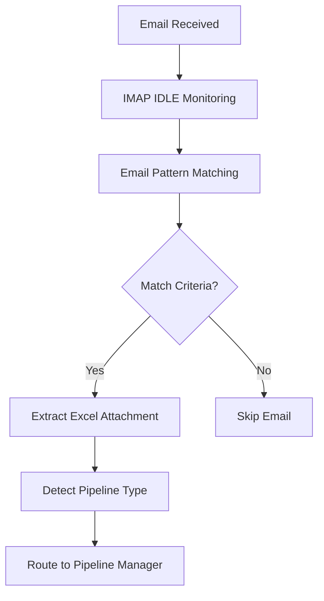
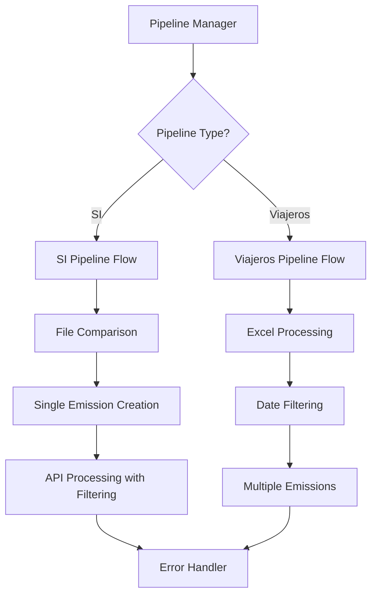
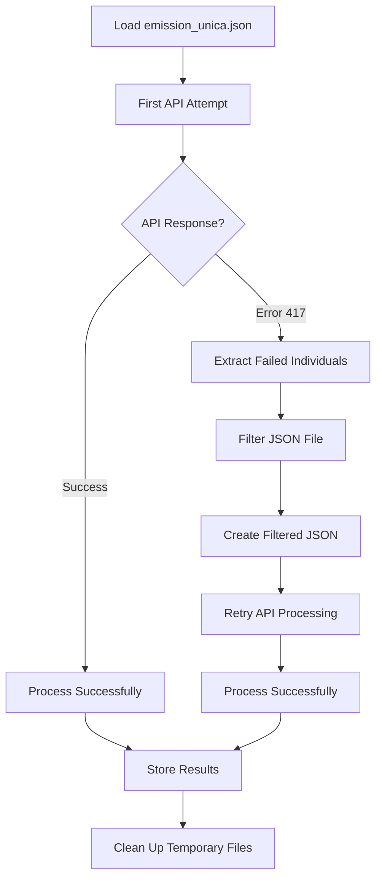
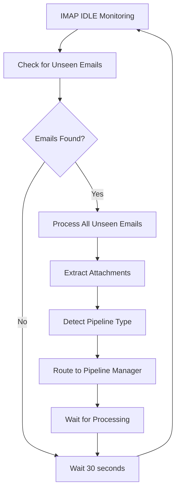

# Complete System Flow Documentation

## 📋 Table of Contents

1. [System Overview](#system-overview)
2. [Complete Data Flow](#complete-data-flow)
3. [Pipeline Manager Flow](#pipeline-manager-flow)
4. [Error Handling Flow](#error-handling-flow)
5. [Individual Filtering Implementation](#individual-filtering-implementation)
6. [Email Processing Flow](#email-processing-flow)
7. [Database and State Management](#database-and-state-management)
8. [Report Generation Flow](#report-generation-flow)

---

## 🏗️ System Overview

The Humano Multi-Pipeline Container is an automated insurance data processing system that handles two distinct pipelines with advanced error handling and individual filtering capabilities.

### **Key Components:**

1. **Email Watcher** (`email_watcher/pipeline_watcher.py`)
2. **Pipeline Manager** (`pipeline_manager.py`)
3. **Pipeline Coordinator** (`shared/pipeline_coordinator.py`)
4. **Error Handler** (`shared/error_handler.py`)
5. **SI Pipeline** (`si_pipeline/main.py` + `corrected_main.py`)
6. **Viajeros Pipeline** (`viajeros_pipeline/main.py`)

### **Enhanced Features:**

- ✅ **Individual Filtering**: Automatically removes individuals with active coverage
- ✅ **Retry Logic**: Re-processes filtered data after API errors
- ✅ **Comprehensive Reporting**: Detailed individual information in emails
- ✅ **Pipeline Coordination**: Manages simultaneous pipeline execution
- ✅ **Error Recovery**: Handles API validation errors gracefully

---

## 🔄 Complete Data Flow

### **1. Email Reception and Processing**



**Email Detection Logic:**
```python
# Subject Pattern Matching
MATCH_SUBJECT_REGEX = r"(?i)^asegurados (viajeros|salud internacional)\s*\|\s*\d{4}-\d{2}-\d{2}$"

# Sender Pattern Matching  
MATCH_FROM_REGEX = r"(?i)notificacionesinteligenciatecnicaSI@humano\.com\.do"

# Pipeline Type Detection
def detect_pipeline_type(subject, from_addr):
    if "asegurados viajeros" in subject.lower():
        return "viajeros"
    elif "asegurados salud internacional" in subject.lower():
        return "si"
    else:
        return "unknown"
```

### **2. Pipeline Manager Routing**



---

## 🏥 SI Pipeline Flow (Enhanced with Individual Filtering)

### **Step 1: File Comparison**
```python
def comparador_SI():
    # Compare old vs new Excel files
    old_df = pd.read_excel('Asegurados_SI_old.xlsx')
    new_df = pd.read_excel('Asegurados_SI.xlsx')
    
    # Find new records
    new_records = new_df[~new_df['CODIGO_INFOPLAN'].isin(old_df['CODIGO_INFOPLAN'])]
    
    # Create comparison result
    with pd.ExcelWriter('comparison_result.xlsx') as writer:
        new_records.to_excel(writer, sheet_name='New in New File', index=False)
    
    # AUTOMATICALLY replace old file with new file
    os.replace('Asegurados_SI.xlsx', 'Asegurados_SI_old.xlsx')
```

### **Step 2: Single Emission Creation**
```python
def create_single_emission(excel_path, output_path):
    # Read comparison result (only new records)
    df = pd.read_excel(excel_path)
    
    # Process each new individual
    insured_list = []
    for _, row in df.iterrows():
        insured_list.append({
            "identity": "",
            "passport": row.get("CODIGO_INFOPLAN"),
            "firstname": process_name(row.get("PRI_NOM"), row.get("SEG_NOM")),
            "lastname": process_name(row.get("PRI_APE"), row.get("SEG_APE")),
            "birthdate": parse_date_safe(row.get("FEC_NAC")),
            "gender": row.get("SEXO", "M")
        })
    
    # Create emission JSON
    emission_data = {
        policy_number: {
            "metadata": {...},
            "emision": {
                "insured": insured_list,
                ...
            }
        }
    }
```

### **Step 3: API Processing with Individual Filtering**



**Individual Filtering Logic:**
```python
def process_si_emission_with_retry(json_path="emision_unica.json"):
    # First attempt: Process original JSON
    emisiones_exitosas, emisiones_fallidas = procesar_validacion(emisiones_path=json_path)
    
    # Check for API validation errors (417)
    api_validation_errors = [f for f in emisiones_fallidas 
                            if f.get('error_details', {}).get('status_code') == 417]
    
    if api_validation_errors:
        # Extract all failed individuals
        all_failed_individuals = []
        for failure in api_validation_errors:
            api_response = failure['error_details']['api_response']
            failed_individuals = extract_failed_individuals_from_api_response(api_response)
            all_failed_individuals.extend(failed_individuals)
        
        # Filter the JSON to remove failed individuals
        filtered_json_path, removed_individuals = filter_individuals_from_json(
            json_path, all_failed_individuals
        )
        
        # Retry processing with filtered JSON
        emisiones_exitosas_retry, _ = procesar_validacion(emisiones_path=filtered_json_path)
        
        # Store failed individuals data for email reporting
        store_failed_individuals_data(failed_individuals_data, all_failed_individuals)
        
        # Clean up filtered file
        os.remove(filtered_json_path)
```

---

## 🧳 Viajeros Pipeline Flow

### **Step 1: Excel Processing**
```python
def run_viajeros_pipeline():
    # Load Excel file
    df = pd.read_excel('Asegurados_Viajeros.xlsx')
    
    # Apply date filtering
    df_filtered = df[df['FEC_INI'] >= '2025-04-01']
    
    # Generate multiple emissions
    for group in df_filtered.groupby('FACTURA'):
        create_emission_json(group)
```

### **Step 2: API Processing**
```python
def procesar_validacion(emisiones_path):
    # Process each emission through Goval API
    for factura, emision in emisiones.items():
        # 1. Create quotation
        cotizacion_result = cotizar_emision(emision)
        
        # 2. Manager validation
        manager_result = process_manager_validation(cotizacion_id, token)
        
        # 3. Apply payment
        payment_result = apply_payment(cotizacion_id, token, final_uri)
        
        # Track results
        if success:
            tracker.track_emission(factura, {"tracking_id": payment_result["ticket_id"]})
        else:
            tracker.track_emission(factura, {"error": error_message})
```

---

## 🔄 Pipeline Manager Flow

### **Pipeline Manager Responsibilities:**

1. **Pipeline Type Detection**
2. **File Routing and Validation**
3. **Pipeline Execution Management**
4. **Error Handling and Reporting**
5. **Coordination Integration**

```python
def process_email(pipeline_type, excel_file_path, email_subject=None):
    """Route email to appropriate pipeline with coordination."""
    
    # Start pipeline session
    session_id = coordinator.start_pipeline_session(pipeline_type, email_subject)
    
    try:
        if pipeline_type == "viajeros":
            run_viajeros_pipeline(excel_file_path, email_subject)
        elif pipeline_type == "si":
            run_si_pipeline(excel_file_path, email_subject)
        
        # Complete pipeline session
        coordinator.complete_pipeline(pipeline_type, session_id, success=True)
        
    except Exception as e:
        coordinator.complete_pipeline(pipeline_type, session_id, success=False, error_message=str(e))
```

### **SI Pipeline Manager Enhancement:**
```python
def run_si_pipeline(excel_file_path, email_subject=None):
    # Use corrected SI pipeline with individual filtering
    result = subprocess.run([
        "python", "-c",
        f"""
        from corrected_main import run_si_pipeline_with_corrected_filtering
        success, successful_emissions, failed_individuals_data, all_failed_individuals = run_si_pipeline_with_corrected_filtering()
        
        # Store failed individuals data for email reporting
        if failed_individuals_data:
            with open('/app/si_pipeline/data/latest_failed_individuals.json', 'w') as f:
                json.dump({{
                    'failed_individuals_data': failed_individuals_data,
                    'all_failed_individuals': all_failed_individuals,
                    'email_subject': '{email_subject}',
                    'timestamp': datetime.now().isoformat()
                }}, f, indent=2)
        """
    ])
```

---

## 🚨 Error Handling Flow

### **Error Handler Responsibilities:**

1. **Pipeline-Specific Data Collection**
2. **Failed Individual Data Processing**
3. **HTML Report Generation**
4. **Email Delivery via Resend API**

```python
class ErrorHandler:
    def __init__(self, pipeline_type: str = None):
        self.pipeline_type = pipeline_type
        if pipeline_type == 'si':
            self.data_dir = Path('/app/si_pipeline/data')
            self.pipeline_name = "Salud Internacional (SI)"
        elif pipeline_type == 'viajeros':
            self.data_dir = Path('/app/viajeros_pipeline/data')
            self.pipeline_name = "Viajeros"
    
    def send_report(self, email_received=True, excel_extracted=True, 
                   pipeline_success=True, error_message=None, 
                   email_subject=None, failed_individuals=None):
        
        # For SI pipeline, automatically get failed individuals if not provided
        if self.pipeline_type == 'si' and failed_individuals is None:
            failed_individuals = self.get_si_failed_individuals_data()
        
        # Generate comprehensive HTML report
        html_content = self.generate_report(
            email_received, excel_extracted, pipeline_success, 
            error_message, failed_individuals
        )
        
        # Send via Resend API
        self._send_email_report(html_content, email_subject)
```

### **Failed Individual Data Structure:**
```json
{
  "failed_individuals_data": [
    {
      "factura": "202509221135",
      "removed_individuals": [
        {
          "firstname": "CARLOS MANUEL",
          "lastname": "DE LOS SANTOS SANTOS",
          "passport": "3150560-0",
          "birthdate": "1985-06-25"
        }
      ],
      "api_failed_individuals": [
        {
          "ticket_id": "HUM-3ED6D-3D60",
          "passport": "3150560-0",
          "firstname": "CARLOS MANUEL",
          "lastname": "DE LOS SANTOS SANTOS",
          "birthdate": "1985-06-25"
        }
      ],
      "error_details": {
        "status_code": 417,
        "api_response": {...}
      }
    }
  ],
  "all_failed_individuals": [...],
  "email_subject": "Asegurados Salud Internacional | 2025-09-22",
  "timestamp": "2025-09-22T11:35:28.892"
}
```

---

## 📧 Email Processing Flow

### **Email Watcher Process:**



### **Multiple Email Processing:**
```python
def process_new_unseen(client, con):
    """Process all unseen emails with date-based ordering."""
    
    # Get all unseen emails
    unseen_uids = client.search(["UNSEEN"])
    
    # Process each email
    emails_to_process = []
    for uid in unseen_uids:
        # Extract email data
        email_data = extract_email_data(uid)
        
        # Check if should process
        if should_trigger(email_data['msg']):
            # Extract date from subject for ordering
            subject_date = extract_date_from_subject(email_data['subject'])
            emails_to_process.append({
                'uid': uid,
                'msg': email_data['msg'],
                'subject': email_data['subject'],
                'subject_date': subject_date
            })
    
    # Sort by date (oldest first)
    emails_to_process.sort(key=lambda x: x['subject_date'])
    
    # Process sequentially to avoid conflicts
    for email_data in emails_to_process:
        process_single_email(email_data)
        time.sleep(2)  # Small delay between emails
```

---

## 🗄️ Database and State Management

### **Pipeline Coordination Database:**
```sql
-- Pipeline sessions tracking
CREATE TABLE pipeline_sessions (
    session_id TEXT PRIMARY KEY,
    si_status TEXT DEFAULT 'pending',
    viajeros_status TEXT DEFAULT 'pending',
    si_started_at TIMESTAMP,
    viajeros_started_at TIMESTAMP,
    si_completed_at TIMESTAMP,
    viajeros_completed_at TIMESTAMP,
    combined_report_sent BOOLEAN DEFAULT FALSE,
    created_at TIMESTAMP DEFAULT CURRENT_TIMESTAMP,
    updated_at TIMESTAMP DEFAULT CURRENT_TIMESTAMP
);

-- Pipeline execution logging
CREATE TABLE pipeline_executions (
    id INTEGER PRIMARY KEY AUTOINCREMENT,
    session_id TEXT,
    pipeline_type TEXT,
    status TEXT,
    started_at TIMESTAMP,
    completed_at TIMESTAMP,
    error_message TEXT,
    FOREIGN KEY (session_id) REFERENCES pipeline_sessions(session_id)
);

-- Processed emails tracking
CREATE TABLE processed_emails (
    message_id TEXT PRIMARY KEY,
    subject TEXT,
    from_addr TEXT,
    processed_at TIMESTAMP DEFAULT CURRENT_TIMESTAMP,
    pipeline_type TEXT
);
```

### **State Management Flow:**
```python
def start_pipeline_session(pipeline_type, email_subject=None):
    """Start or join a pipeline session."""
    session_id = get_or_create_session()
    
    # Update pipeline status
    cursor.execute(f"""
        UPDATE pipeline_sessions 
        SET {pipeline_type}_status = 'running', 
            {pipeline_type}_started_at = CURRENT_TIMESTAMP
        WHERE session_id = ?
    """, (session_id,))
    
    # Log execution with email subject
    cursor.execute("""
        INSERT INTO pipeline_executions (session_id, pipeline_type, status, error_message)
        VALUES (?, ?, 'running', ?)
    """, (session_id, pipeline_type, f"Email subject: {email_subject}"))
    
    return session_id
```

---

## 📊 Report Generation Flow

### **Report Types:**

1. **Single Pipeline Report**: Immediate report for individual pipeline
2. **Combined Report**: Unified report for both pipelines (5-minute coordination)
3. **Timeout Report**: Partial report if coordination times out

### **Report Content Structure:**

```html
<!DOCTYPE html>
<html>
<head>
    <title>Daily Insurance Policy Processing Report - {pipeline_name}</title>
    <style>
        .si-section { background-color: #fff3cd; border-left: 4px solid #ffc107; }
        .viajeros-section { background-color: #d1ecf1; border-left: 4px solid #17a2b8; }
        .individual-detail { background-color: #fff3cd; padding: 10px; margin: 5px 0; }
    </style>
</head>
<body>
    <div class="header">
        <h1>✅ [SI] Daily Report - 1 policies processed successfully</h1>
        <p>Email Subject: Asegurados Salud Internacional | 2025-09-22</p>
    </div>
    
    <div class="section">
        <h2>📊 Processing Statistics</h2>
        <div class="stats">
            <div class="stat-box">
                <h3>1</h3>
                <p>Successful Emissions</p>
            </div>
            <div class="stat-box">
                <h3>1</h3>
                <p>Individuals Removed</p>
            </div>
        </div>
    </div>
    
    <div class="section si-section">
        <h2>🚨 Individuals with Active Coverage (Removed from Processing)</h2>
        <div class="individual-detail">
            <h4>Individual #1</h4>
            <p><strong>Name:</strong> CARLOS MANUEL DE LOS SANTOS SANTOS</p>
            <p><strong>Passport:</strong> 3150560-0</p>
            <p><strong>Birth Date:</strong> 1985-06-25</p>
            <p><strong>Ticket ID:</strong> HUM-3ED6D-3D60</p>
        </div>
    </div>
</body>
</html>
```

### **Email Delivery:**
```python
def _send_email_report(self, html_content, email_subject):
    """Send report via Resend API."""
    
    params = {
        "from": "info@angelguardassist.com",
        "to": self.report_recipients,
        "subject": self.subject,
        "html": html_content
    }
    
    try:
        response = resend.Emails.send(params)
        logger.info(f"✅ Email report sent successfully: {response['id']}")
        return True
    except Exception as e:
        logger.error(f"❌ Failed to send email report: {e}")
        return False
```

---

## 🔧 Configuration and Environment

### **Environment Variables:**
```bash
# IMAP Configuration
IMAP_HOST=secure.emailsrvr.com
IMAP_USER=ismael.ramirezaybar@agassist.net
IMAP_PASS=@bcD1234#
IMAP_FOLDER=INBOX
IMAP_SSL=true
IMAP_PORT=993

# Email Filtering
MATCH_SUBJECT_REGEX=(?i)^asegurados (viajeros|salud internacional)\s*\|\s*\d{4}-\d{2}-\d{2}$
MATCH_FROM_REGEX=(?i)notificacionesinteligenciatecnicaSI@humano\.com\.do

# Pipeline Configuration
AUTOMATED_MODE=true
STATE_DB=/state/processed.sqlite3
POLL_INTERVAL_SEC=30

# Goval API Configuration
GOVAL_API_URL=https://humano.goval-tpa.com/api
USUARIO=your_goval_username
PASSWORD=your_goval_password

# Email Reporting
RESEND_API_KEY=re_7nu2jYdo_6zaFWM9ZdfMKM6Zcq4yrweuv
```

### **Docker Configuration:**
```yaml
services:
  humano-multi-pipeline:
    build: .
    container_name: humano-multi-pipeline
    restart: unless-stopped
    environment:
      # All environment variables
    volumes:
      - ./shared/database/state:/state
      - ./viajeros_pipeline/Exceles:/app/viajeros_pipeline/Exceles
      - ./si_pipeline/Comparador_Humano/exceles:/app/si_pipeline/Comparador_Humano/exceles
      - ./shared/logs:/app/logs
      - ./viajeros_pipeline/data:/app/viajeros_pipeline/data
      - ./si_pipeline/data:/app/si_pipeline/data
    healthcheck:
      test: ["CMD", "python", "/app/health_check.py"]
      interval: 60s
      timeout: 30s
      retries: 3
```

---

## 📈 Monitoring and Troubleshooting

### **Key Log Patterns:**
```bash
# Email processing
grep "Email processing" ./shared/logs/*.log

# Pipeline execution
grep "\[si\]\|\[viajeros\]" ./shared/logs/*.log

# Individual filtering
grep "Failed individuals\|Filtered JSON\|Retry processing" ./shared/logs/*.log

# API errors
grep "Error 417\|Active coverage\|Validation failed" ./shared/logs/*.log
```

### **Database Queries:**
```sql
-- Check recent pipeline sessions
SELECT * FROM pipeline_sessions 
WHERE created_at > datetime('now', '-1 day')
ORDER BY created_at DESC;

-- Check failed individuals data
SELECT * FROM pipeline_executions 
WHERE error_message LIKE '%Email subject:%'
ORDER BY started_at DESC;

-- Check processed emails
SELECT * FROM processed_emails 
ORDER BY processed_at DESC LIMIT 10;
```

---

## 🎯 Benefits of Enhanced Implementation

### **1. Automatic Error Recovery**
- **Individual Filtering**: Removes problematic individuals automatically
- **Retry Logic**: Continues processing with valid individuals
- **Data Integrity**: Ensures only processable data reaches the API

### **2. Comprehensive Reporting**
- **Detailed Individual Information**: Shows exactly who was removed and why
- **Processing Transparency**: Clear visibility into what was processed vs removed
- **Email Subject Integration**: Links reports back to original email

### **3. Robust Error Handling**
- **API Error Detection**: Specifically handles error 417 (active coverage)
- **Data Preservation**: Stores all failure information for analysis
- **Graceful Degradation**: Continues processing even with partial failures

### **4. Production Ready**
- **Docker Integration**: Complete containerized solution
- **State Management**: Persistent tracking across restarts
- **Monitoring**: Comprehensive logging and health checks
- **Scalability**: Handles multiple emails and pipelines simultaneously

---

*Last Updated: September 2025*
*Version: 3.0 - Enhanced with Individual Filtering*
*Maintained by: AG Assist Development Team*
