# Mermaid Flow Diagrams

## 🏗️ Complete System Architecture

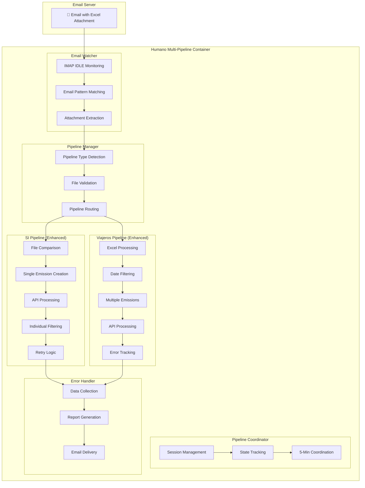

## 📧 Email Processing Flow

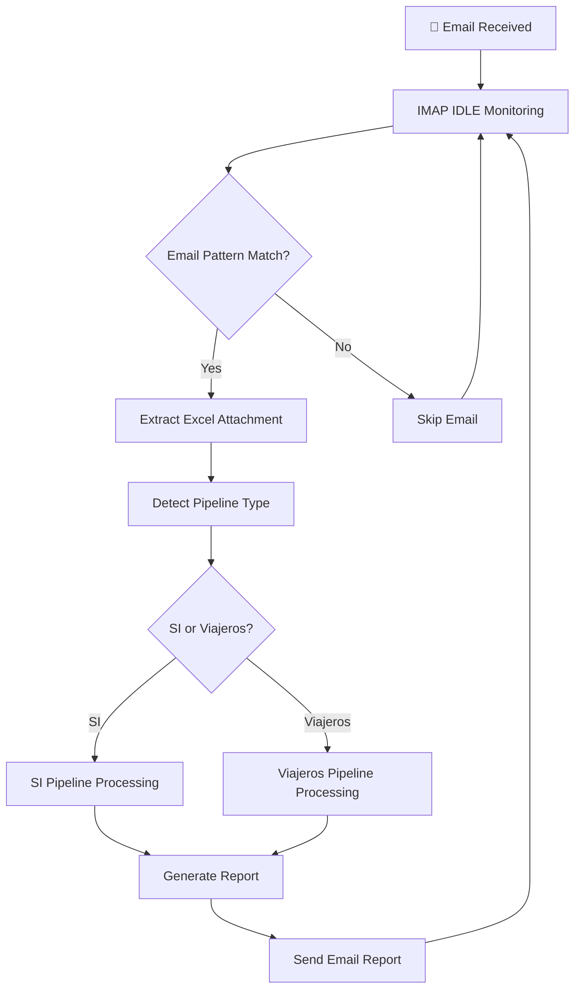

## 🏥 SI Pipeline Flow (Enhanced with Individual Filtering)

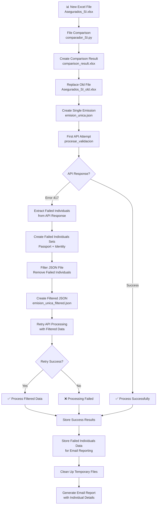

## 🧳 Viajeros Pipeline Flow (Enhanced with Detailed Reporting)

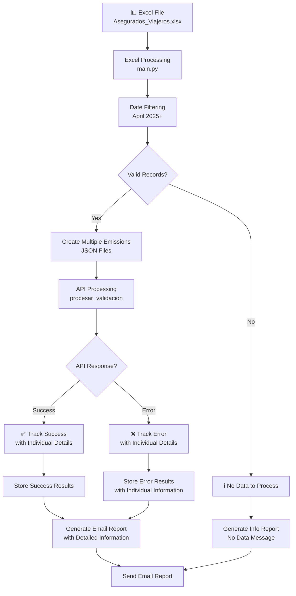

## 🔄 Pipeline Manager Flow

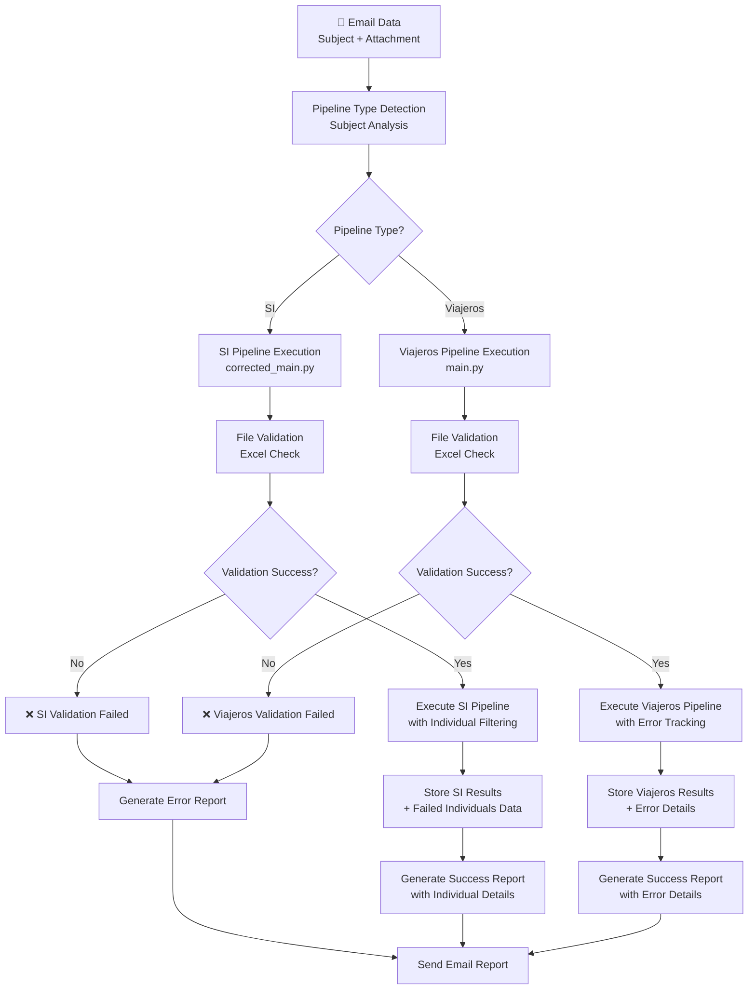

## 🚨 Error Handler Flow

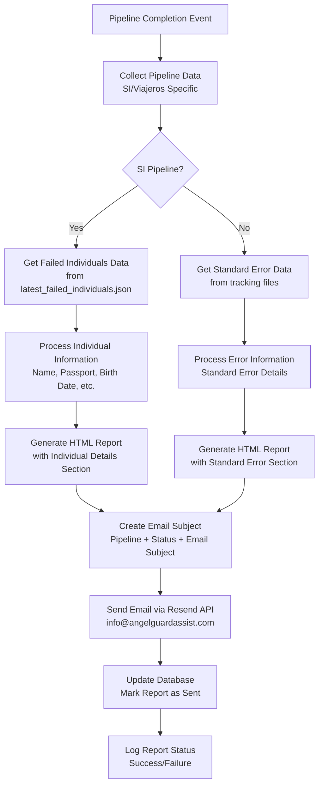

## 📊 Individual Filtering Process (SI Pipeline)

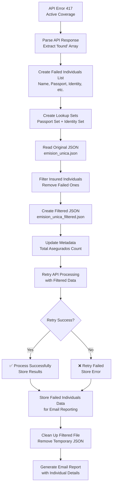

## 🗄️ Database and State Management

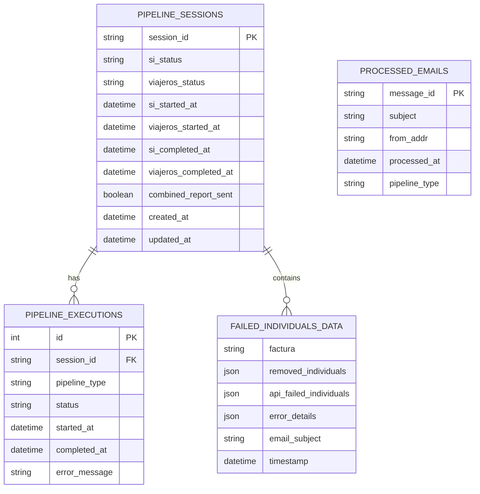

## 📧 Email Report Structure

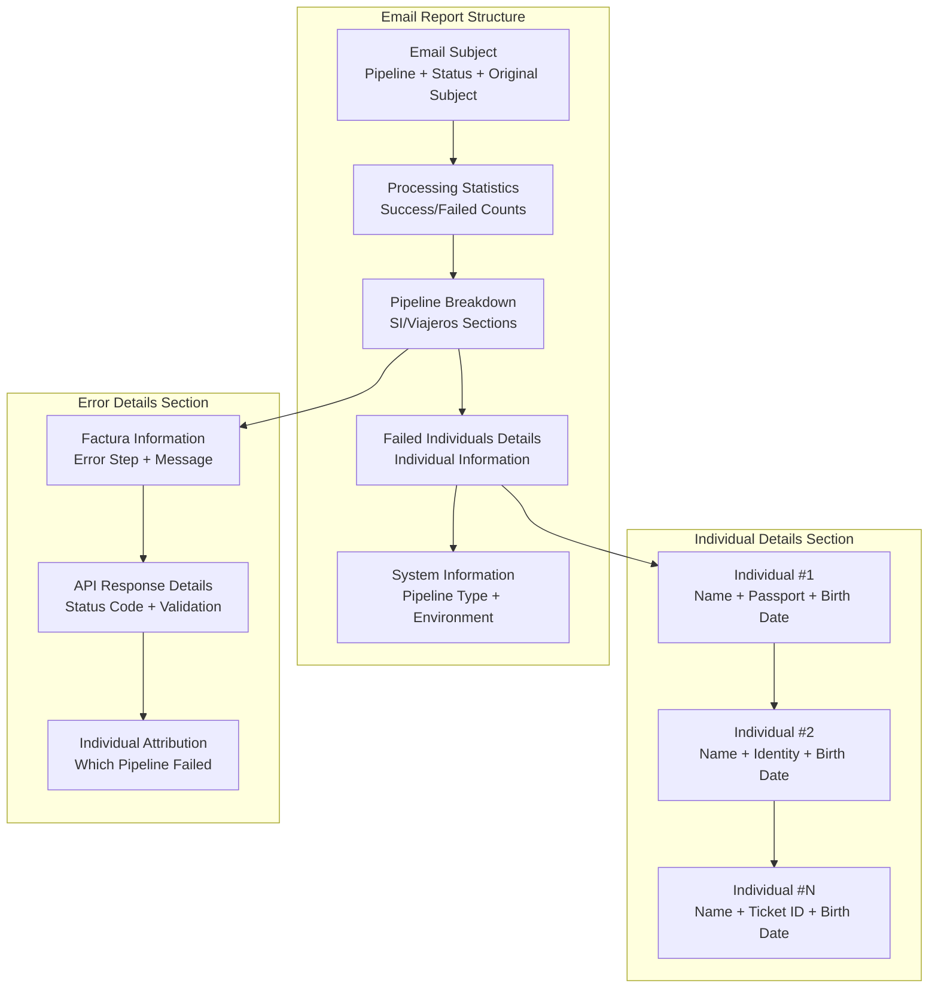

## 🔧 Configuration and Environment

```mermaid
graph TB
    subgraph "Environment Configuration"
        A[.env File<br/>Environment Variables]
        B[Docker Compose<br/>Container Configuration]
        C[Volume Mounts<br/>Persistent Data]
    end
    
    subgraph "IMAP Configuration"
        D[IMAP_HOST<br/>secure.emailsrvr.com]
        E[IMAP_USER<br/>ismael.ramirezaybar@agassist.net]
        F[IMAP_PASS<br/>@bcD1234#]
        G[IMAP_FOLDER<br/>INBOX]
    end
    
    subgraph "Pipeline Configuration"
        H[AUTOMATED_MODE<br/>true]
        I[STATE_DB<br/>/state/processed.sqlite3]
        J[POLL_INTERVAL_SEC<br/>30]
    end
    
    subgraph "API Configuration"
        K[GOVAL_API_URL<br/>https://humano.goval-tpa.com/api]
        L[USUARIO<br/>Goval Username]
        M[PASSWORD<br/>Goval Password]
        N[RESEND_API_KEY<br/>Email Delivery]
    end
    
    A --> D
    A --> E
    A --> F
    A --> G
    A --> H
    A --> I
    A --> J
    A --> K
    A --> L
    A --> M
    A --> N
    B --> C
```

## 📈 Monitoring and Health Checks

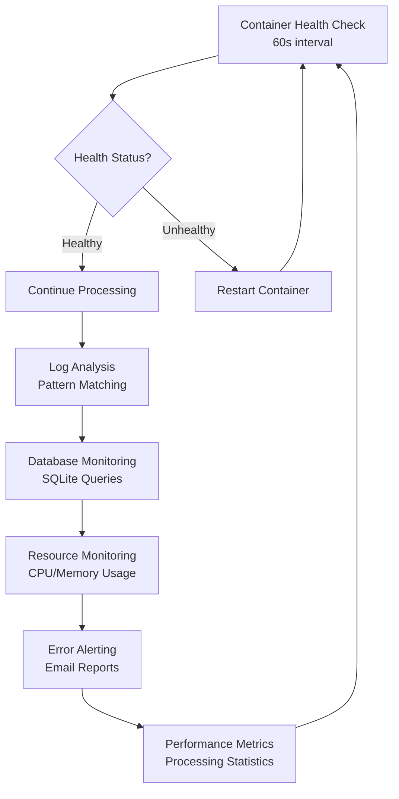

## 🎯 Key Data Flows Summary

### **1. Email Processing Flow:**
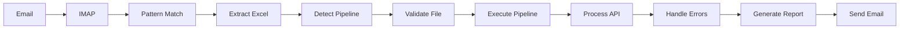

### **2. SI Pipeline with Individual Filtering:**
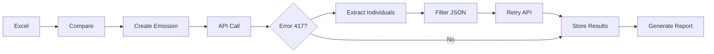

### **3. Viajeros Pipeline with Error Reporting:**
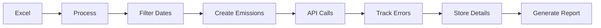

### **4. Error Handling and Reporting:**
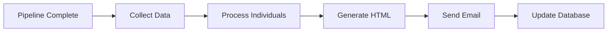

These Mermaid diagrams provide a comprehensive visual representation of the complete system flow, including the enhanced individual filtering capabilities and detailed error handling for both SI and Viajeros pipelines.
